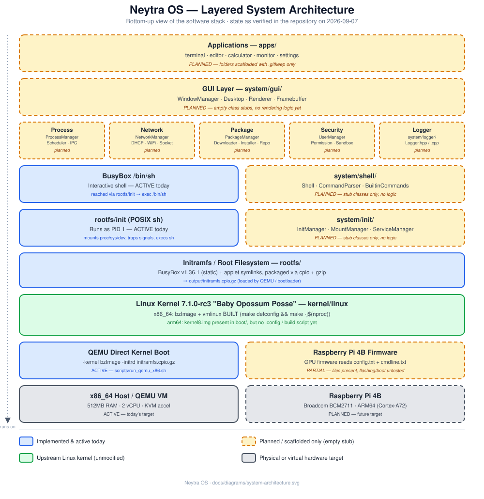
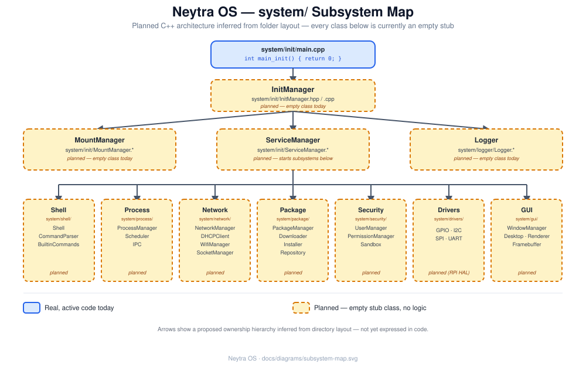

# Architecture

Neytra OS is built as a stack of layers, the same way most Linux-based systems are: hardware, firmware, kernel, root filesystem, init, shell, then everything else (services, GUI, apps). What makes this doc useful is that it tells you **which of those layers are real today** and which are scaffolding for later phases — see [../README.md](../README.md) for the project's own "don't start with the GUI" philosophy that explains why so much is still a stub.

## Layered view



Reading it bottom-up:

1. **Hardware** — an x86_64 QEMU virtual machine today; a Raspberry Pi 4B (Broadcom BCM2711, ARM64) is the future target.
2. **Firmware / bootloader** — QEMU's direct kernel boot (`-kernel`/`-initrd`, no bootloader needed) today; the RPi path (GPU firmware reading `config.txt`/`cmdline.txt`) has its boot files in place but is untested end-to-end.
3. **Linux kernel** — a real, unmodified upstream kernel (`kernel/linux`), configured and built for x86_64. See [kernel-build.md](kernel-build.md).
4. **Initramfs / root filesystem** — `rootfs/`, populated with BusyBox and packaged into `output/initramfs.cpio.gz`. See [rootfs.md](rootfs.md).
5. **Init process (PID 1)** — `rootfs/init`, a POSIX shell script. This is what the kernel actually executes today. See [boot-process.md](boot-process.md).
6. **Shell** — BusyBox's `/bin/sh`, reached via `exec /bin/sh` at the end of `rootfs/init`.
7. **System services, GUI, applications** — all scaffolded under `system/`, `apps/`, `services/` as empty C++ class stubs or empty folders. None of this runs yet.

## Why a C++ `system/` layer exists but does nothing yet

The repository already has the *shape* of a self-hosted C++ system layer (an init manager, a shell, drivers, a GUI toolkit, networking, a package manager, process management, security) under [system/](../system/). Most files in it are still one- or two-line placeholders — for example:

```cpp
// Shell.hpp - placeholder
#pragma once
class Shell {};
```

This is intentional scaffolding, not a bug: the root [README.md](../README.md) explicitly lays out a "professional workflow" that says *not* to start with the GUI, networking, or package manager, and to instead nail the kernel → rootfs → init → shell → QEMU boot loop first. That loop is done (see the diagram above — everything in the bottom half is solid blue). The `system/` C++ layer is the next phase, and its first two slices — `system/logger/Logger` (fully working) and `system/init/` (interface + dependency-injection skeleton in place, mount/service logic still stub) — are underway (see [Design principles](#design-principles) below).

### Planned `system/` module map



> The diagram predates `Logger`'s implementation and still shows it as a planned stub — the table below is the up-to-date source of truth.

| Folder | Classes | Role / status |
|---|---|---|
| `system/init/` | `IInitManager`/`InitManager`, `IMountManager`/`MountManager`, `IServiceManager`/`ServiceManager` | Replace `rootfs/init` as PID 1 — **🚧 interface + DI skeleton implemented**, built as `neytra_init`, covered by `tests/init/init_test.cpp`; `mountAll()`/`startAll()` bodies are still stubs |
| `system/logger/` | `Logger` | Central leveled logger (console + optional file sink) — **✅ implemented**, built as `neytra_logger` via `CMakeLists.txt`, covered by `tests/logger/logger_test.cpp` |
| `system/shell/` | `Shell`, `CommandParser`, `BuiltinCommands` | Replace BusyBox `/bin/sh` with a native Neytra shell — *stub* |
| `system/process/` | `ProcessManager`, `Scheduler`, `IPC` | Process supervision and inter-process communication — *stub* |
| `system/network/` | `NetworkManager`, `DHCPClient`, `WifiManager`, `SocketManager` | Networking stack (see [networking.md](networking.md)) — *stub* |
| `system/package/` | `PackageManager`, `Downloader`, `Installer`, `Repository` | Package management (see [package-manager.md](package-manager.md)) — *stub* |
| `system/security/` | `UserManager`, `PermissionManager`, `Sandbox` | Users, permissions, process sandboxing — *stub* |
| `system/drivers/` | `GPIO`, `I2C`, `SPI`, `UART` | Raspberry Pi hardware access (see [raspberrypi.md](raspberrypi.md)) — *stub* |
| `system/gui/` | `WindowManager`, `Desktop`, `Renderer`, `Framebuffer` | Framebuffer-based GUI — *stub* |

The ownership arrows in the diagram (`InitManager` → `ServiceManager` → each subsystem) are a **proposed** hierarchy inferred from the folder layout, not something expressed in code yet. Treat it as a starting design, not a constraint.

## Build wiring status

`CMakeLists.txt` builds two real targets so far: `neytra_logger` (static library from
`system/logger/Logger.cpp`) and `neytra_init` (static library from `system/init/*.cpp`,
linked against `neytra_logger`), each with a `ctest`-registered smoke test
(`logger_test`, `init_test`). The rest of `system/` still has no build target — each
subsystem needs its own `add_library`/`add_executable` added as it gains real logic,
following the pattern below.

## Design principles

This section exists because a from-scratch OS is exactly the kind of project where early
shortcuts (global singletons, managers that `new` their own dependencies, everything
including everything) calcify into a tightly-coupled mess by the time you have a dozen
subsystems. The rules below are mandatory for every `system/` module from here on —
`system/init/` is the reference implementation; read it alongside this section.

### 1. Depend on interfaces, not concrete classes (Dependency Inversion)

Every module that other code needs to call gets a pure-virtual interface (`IFoo`)
separate from its concrete implementation (`Foo : public IFoo`):

```cpp
class IMountManager {
public:
    virtual ~IMountManager() = default;
    virtual bool mountAll() = 0;
};

class MountManager : public IMountManager {
public:
    bool mountAll() override;
};
```

Callers hold a reference/pointer to `IMountManager`, never to `MountManager` directly.
This is what makes modules swappable: a test can hand `InitManager` a fake
`IMountManager` that always succeeds (or always fails), with zero changes to
`InitManager` itself.

### 2. Wire dependencies in through the constructor (Dependency Injection)

A module never constructs its own collaborators. `InitManager` doesn't create a
`MountManager` internally — it receives `IMountManager&`, `IServiceManager&`, and
`ILogger&` as constructor arguments:

```cpp
class InitManager : public IInitManager {
public:
    InitManager(IMountManager& mountManager, IServiceManager& serviceManager, ILogger& logger);
    bool run() override;
private:
    IMountManager& mountManager_;
    IServiceManager& serviceManager_;
    ILogger& logger_;
};
```

This keeps `InitManager` ignorant of *which* mount manager or logger it's talking to —
it only knows the interface's contract.

### 3. Construct and wire concrete types in one place (Composition Root)

Somewhere has to actually build the real objects and hand them to each other — that
place is `main.cpp` (or a test's `main()`), never buried inside business logic:

```cpp
// system/init/main.cpp
int main_init() {
    MountManager mountManager;
    ServiceManager serviceManager;
    InitManager initManager(mountManager, serviceManager, Logger::instance());
    return initManager.run() ? 0 : 1;
}
```

`tests/init/init_test.cpp` does the same wiring independently, which is exactly the
point: the composition root is the *only* code that needs to change to swap an
implementation, add a fake for testing, or reconfigure the system.

### 4. `Logger`/`ILogger` is the one deliberate exception, and only partially

Threading a logger reference through every constructor in the codebase is impractical —
logging is a cross-cutting concern almost everything needs. So `Logger::instance()`
(a singleton) exists as a convenience **default**, but the rule is: **only composition
roots (`main.cpp`, `tests/*/*_test.cpp`) are allowed to call `Logger::instance()`
directly.** Everything else — like `InitManager` above — takes `ILogger&` as a
constructor parameter and never knows it's talking to a singleton. This gets you the
convenience of a global logger without every module being compile-time coupled to the
concrete `Logger` class.

### 5. Patterns reserved for later (don't pre-build these speculatively)

These are already decided, but intentionally **not** implemented anywhere yet, because
building them before there's a second real use case is speculative complexity for no
current payoff ([YAGNI](https://en.wikipedia.org/wiki/You_aren%27t_gonna_need_it)):

- **Observer / event bus** for *cross-module* notifications (e.g. `ServiceManager`
  publishing "service crashed" for anything to subscribe to) instead of modules calling
  directly into unrelated modules. Reach for this once two independent subsystems need
  to react to the same event (Phase 7+ territory — see [roadmap.md](roadmap.md)).
- **Strategy pattern** for swappable algorithms — e.g. `Scheduler`'s ordering policy or
  `PermissionManager`'s policy evaluation — once there's a second real policy to swap
  between, not before.
- **PIMPL idiom** to hide a class's private members from its own header, if/when
  header-coupling starts causing painful full rebuilds in a much bigger `system/` tree.
  Not worth the extra indirection at the current scale (two modules).

### 6. Don't apply this to everything reflexively

An interface with exactly one implementation forever (and no test that needs a fake)
is just ceremony. Plain data holders (structs, simple value types) don't need an `IFoo`
either. Use judgement — the goal is loose coupling where it matters (things that get
called across module boundaries, or that tests need to fake), not an `I`-prefixed
interface on every class in the codebase.

## See also

- [project-structure.md](project-structure.md) for a directory-by-directory reference.
- [roadmap.md](roadmap.md) for the phase checklist this architecture maps to.
- [development-workflow.md](development-workflow.md) for how to actually build and run what exists today.
