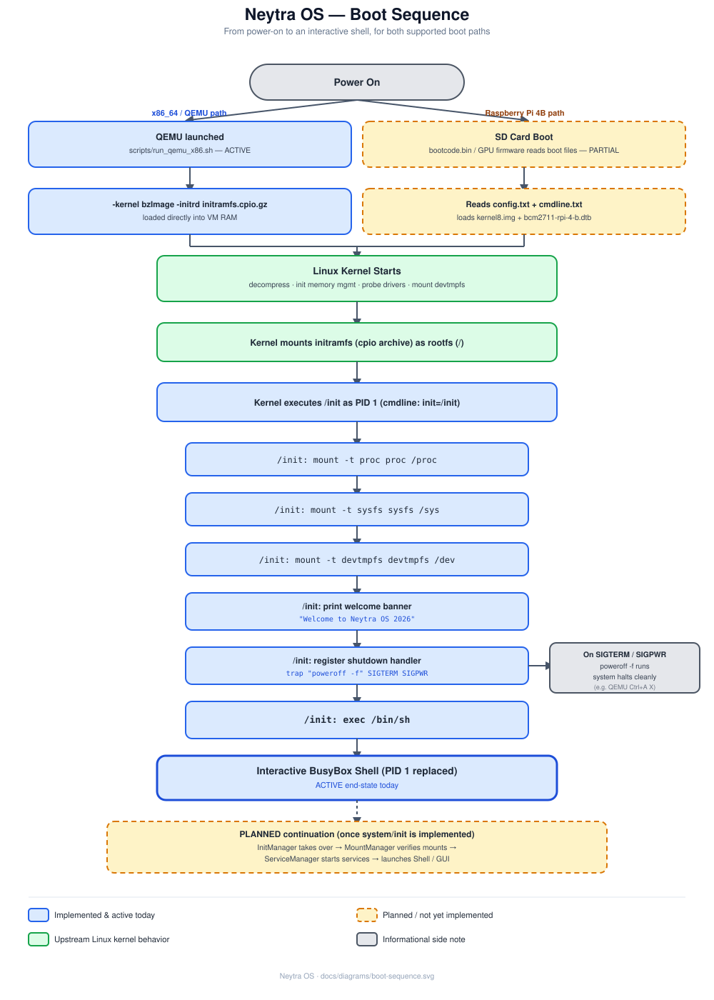
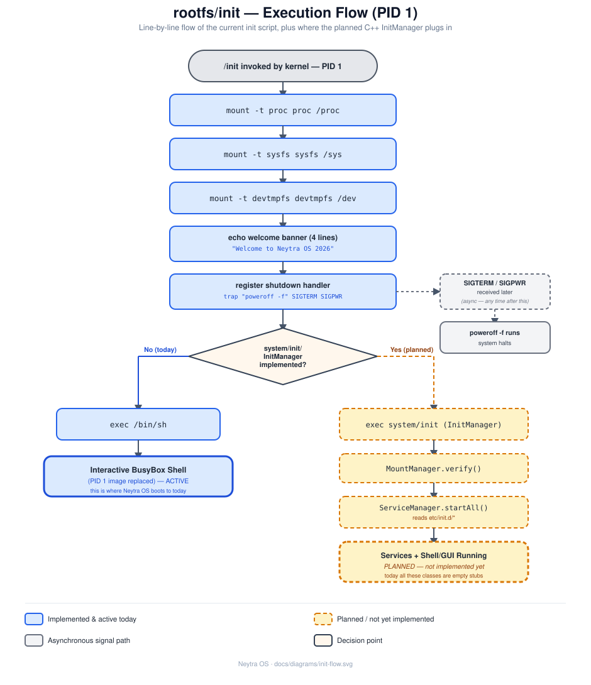

# Boot Process

This is the full path from powering on the machine to getting an interactive shell in Neytra OS, for both the x86_64/QEMU target (works today) and the Raspberry Pi 4B target (files are in place, hardware boot is untested).



## 1. Firmware stage

**x86_64 / QEMU (ACTIVE)** — QEMU is launched via [`scripts/run_qemu_x86.sh`](../scripts/run_qemu_x86.sh), which uses `-kernel` and `-initrd` to load the kernel image and initramfs directly into VM RAM. There is no bootloader (no GRUB) — QEMU's built-in direct-kernel-boot feature stands in for one, which is why the kernel command line is passed straight in via `-append`.

**Raspberry Pi 4B (PARTIAL)** — On real hardware, the SoC's boot ROM reads `bootcode.bin`/GPU firmware from the SD card's FAT boot partition, which then reads [`boot/config.txt`](../boot/config.txt) and [`boot/cmdline.txt`](../boot/cmdline.txt) and loads `boot/kernel8.img` + `boot/bcm2711-rpi-4-b.dtb`. These files already exist in the repo, but there's no `.config` for an arm64 kernel build and no tested flashing path yet — see [raspberrypi.md](raspberrypi.md).

## 2. Kernel stage (both paths converge here)

Once the kernel image is loaded, behavior is identical regardless of platform:

1. The kernel decompresses itself, initializes memory management, and probes built-in drivers.
2. It mounts `devtmpfs` internally and unpacks the initramfs `cpio` archive as the initial root filesystem (`/`).
3. It executes `/init` as **PID 1** — this comes from `init=/init` on the kernel command line (see the `-append` flag in `run_qemu_x86.sh`, or [`boot/cmdline.txt`](../boot/cmdline.txt) for the RPi path, which currently points at a real disk partition rather than the initramfs — see the note in [raspberrypi.md](raspberrypi.md)).

See [kernel-build.md](kernel-build.md) for how that kernel image is produced.

## 3. `/init` stage — PID 1

[`rootfs/init`](../rootfs/init) is a plain POSIX shell script, not a compiled binary or BusyBox's `init` applet. The kernel runs it directly as PID 1:

```sh
#!/bin/sh

mount -t proc proc /proc
mount -t sysfs sysfs /sys
mount -t devtmpfs devtmpfs /dev

echo ""
echo "================================="
echo " Welcome to Neytra OS 2026"
echo "================================="
echo ""

# Handle shutdown signals
trap "poweroff -f" SIGTERM SIGPWR

/bin/sh
```

Step by step:

| Step | What it does |
|---|---|
| `mount -t proc proc /proc` | Mounts the process/kernel info pseudo-filesystem, required by tools like `ps` |
| `mount -t sysfs sysfs /sys` | Mounts the kernel object/device tree, required by most system tools |
| `mount -t devtmpfs devtmpfs /dev` | Ensures device nodes (`/dev/console`, `/dev/null`, etc.) are populated |
| Banner `echo`s | Cosmetic — confirms init ran and reached this point |
| `trap "poweroff -f" SIGTERM SIGPWR` | Registers an asynchronous handler: whenever PID 1 receives `SIGTERM` (normal shutdown request) or `SIGPWR` (power-fail, e.g. QEMU's ACPI shutdown signal), it force-executes `poweroff`. This can fire **at any point after this line**, independent of the rest of the script. |
| `/bin/sh` | Hands off to an interactive BusyBox shell. Since this isn't `exec /bin/sh`, the shell runs as a *child* of `/init` (PID 1 stays alive as the parent) — see the note below. |



> **Note on `exec`:** `scripts/setup_shutdown.sh` and this doc's diagram describe the conceptual "hand off to the shell" step; check [`rootfs/init`](../rootfs/init) directly for the exact current form (plain `/bin/sh` vs `exec /bin/sh`) since that detail affects whether PID 1 survives shell exit. Either way, today's end state is the same observable behavior: an interactive prompt.

### Why `/etc/inittab` isn't actually used (yet)

[`rootfs/etc/inittab`](../rootfs/etc/inittab) exists and looks like a standard BusyBox `init` config:

```
::sysinit:/etc/init.d/rcS
::respawn:/bin/sh
```

But it's **not read by anything today**, because PID 1 is the raw `rootfs/init` shell script, not BusyBox's `init` applet. `inittab` only takes effect if the kernel cmdline is changed to `init=/sbin/init` (BusyBox init) instead of `init=/init`. It's kept in the tree as groundwork for that future switch — don't be confused if editing it has no visible effect right now.

### Shutdown path

Because of the `trap` line, a clean shutdown/reboot at any time later in the session (e.g. from [`rootfs/sbin/shutdown`](../rootfs/sbin/shutdown), or QEMU's monitor sending a power signal) routes through `poweroff -f`, which is a BusyBox applet symlink. `halt`, `reboot`, and `poweroff` in `rootfs/sbin/` are all symlinks to the same `shutdown` script, dispatching on `argv[0]`/flags — see [rootfs.md](rootfs.md#rootfssbin--shutdown-handling).

## 4. End state today

You land in an interactive BusyBox `/bin/sh` prompt inside the VM, connected to your terminal via `console=ttyS0` (serial console, since QEMU is run with `-nographic`).

## Planned continuation

Once [`system/init/InitManager`](../system/init/InitManager.hpp) is implemented (currently an empty class — see [architecture.md](architecture.md)), the intended flow is:

`rootfs/init` → `exec system/init` (InitManager) → `MountManager` verifies mounts → `ServiceManager` reads `etc/init.d/*` and starts services → the Neytra `Shell` and/or GUI launch instead of a bare BusyBox prompt.

## Reproducing this boot yourself

```bash
./scripts/run_qemu_x86.sh
```

See [qemu-setup.md](qemu-setup.md) for what each flag does, and [development-workflow.md](development-workflow.md) for the full build-then-boot loop.
