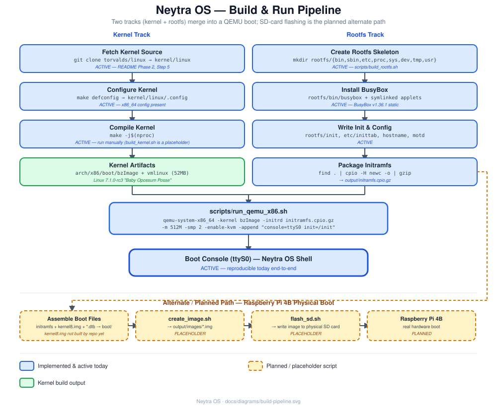

# Development Workflow

The day-to-day loop for working on Neytra OS: environment setup once, then a fast edit → build → boot cycle, plus where tests, debugging, and version control fit in.



## 1. One-time environment setup

```bash
./dev_setup_env.sh
```

This (see [dev_setup.md](../dev_setup.md) for the full package rationale):

1. Installs build tools (`build-essential`, `cmake`, `ninja-build`, `gcc`/`g++`/`clang`), kernel build deps (`bc`, `bison`, `flex`, `libssl-dev`, `libelf-dev`, `libncurses-dev`, `dwarves`, `cpio`), ARM64 cross-compilers, QEMU + KVM, BusyBox, filesystem/bootloader utilities, debugging tools (`gdb`, `strace`, `ltrace`, `valgrind`), and serial tools.
2. Adds your user to the `kvm` and `libvirt` groups (needed for `-enable-kvm`).
3. Verifies `qemu-system-x86_64`, `aarch64-linux-gnu-g++`, and `busybox` are on `PATH`.
4. **Reboots your machine** at the end so the new group membership takes effect — read the script before running it if you want to skip the auto-reboot.

Run this once per machine, not per session.

## 2. The core build loop (x86_64 / QEMU) — works today

```bash
# One-time (or whenever you want to update the kernel):
git clone https://github.com/torvalds/linux.git kernel/linux
cd kernel/linux && make defconfig && make -j$(nproc) && cd ../..

# Every time you change system/ C++ sources (e.g. system/logger/):
./scripts/build_system.sh          # cmake build + install neytra-log into rootfs/usr/bin/

# Every time you change anything under rootfs/:
./scripts/build_rootfs.sh          # full: skeleton + busybox symlinks + package
# — or, faster, if you only edited files already in rootfs/ —
./scripts/create_initramfs.sh      # just repackage, no skeleton/symlink work

# Boot it:
./scripts/run_qemu_x86.sh
```

Exit QEMU with **Ctrl+A** then **X**. See [qemu-setup.md](qemu-setup.md) for flag details and [boot-process.md](boot-process.md) for what you should see.

### Fast iteration tips

- If you're only editing `rootfs/init`, `rootfs/etc/*`, or adding files under `rootfs/`, use `create_initramfs.sh` — it skips the busybox-symlink and skeleton checks that `build_rootfs.sh` does, so it's faster.
- The kernel almost never needs rebuilding unless you change `.config` or are tracking a kernel update — rebuilding it is the slow part (`make -j$(nproc)` on a full kernel tree).
- Keep a second terminal tailing nothing in particular — QEMU with `-nographic` takes over your current terminal's stdio, so run it in a dedicated terminal/tmux pane.

## 3. Building the `system/` C++ layer

The C++ layer under `system/` is compiled with CMake, independently of the kernel/rootfs/QEMU loop above:

```bash
cmake -S . -B build
cmake --build build -j$(nproc)
cd build && ctest --output-on-failure
```

Today this builds two real targets: `neytra_logger` (from `system/logger/Logger.cpp`) and `neytra_init` (from `system/init/*.cpp`, linked against `neytra_logger`), plus their `logger_test`/`init_test` executables — and `neytra-log`, a statically-linked CLI (`system/logger/tools/neytra-log.cpp`) that `scripts/build_system.sh` installs into `rootfs/usr/bin/` so `rootfs/init` can log real boot events through `Logger` instead of `echo` (see [boot-process.md](boot-process.md)). As more of `system/` gains real logic (see [roadmap.md](roadmap.md)), add a matching `add_library`/`add_executable` to `CMakeLists.txt` and a `tests/<subsystem>/` smoke test following the same pattern (plain `main()`, no test framework, registered with `add_test()`) — and follow the interface + constructor-injection convention in [architecture.md](architecture.md#design-principles), not a copy of the old concrete-class stubs.

`build/` is gitignored — safe to delete and reconfigure any time.

## 4. Script reference

| Script                                                   | Status         | What it does                                                                                                                        |
| -------------------------------------------------------- | -------------- | ----------------------------------------------------------------------------------------------------------------------------------- |
| [`build_rootfs.sh`](../scripts/build_rootfs.sh)         | ✅ ACTIVE      | Ensures`rootfs/` skeleton dirs exist, verifies/symlinks BusyBox applets, fixes permissions, packages `output/initramfs.cpio.gz` |
| [`create_initramfs.sh`](../scripts/create_initramfs.sh) | ✅ ACTIVE      | Repackages the current`rootfs/` tree into `output/initramfs.cpio.gz` only — no skeleton/symlink work                           |
| [`run_qemu_x86.sh`](../scripts/run_qemu_x86.sh)         | ✅ ACTIVE      | Boots the built kernel + initramfs in QEMU (KVM-accelerated, serial console)                                                        |
| [`setup_shutdown.sh`](../scripts/setup_shutdown.sh)     | ✅ ACTIVE      | Wires up`rootfs/sbin/{halt,reboot,poweroff}` as symlinks to `shutdown` and sets the executable bit                              |
| [`build_kernel.sh`](../scripts/build_kernel.sh)         | ⏳ PLACEHOLDER | Intended to automate`make defconfig && make -j$(nproc)` in `kernel/linux` — currently just echoes                              |
| [`build_system.sh`](../scripts/build_system.sh)         | ✅ ACTIVE      | Configures/builds the CMake`system/` targets and installs `neytra-log` into `rootfs/usr/bin/`                                 |
| [`clean.sh`](../scripts/clean.sh)                       | ⏳ PLACEHOLDER | Intended to clear`output/` and build artifacts                                                                                    |
| [`create_image.sh`](../scripts/create_image.sh)         | ⏳ PLACEHOLDER | Intended to assemble a flashable disk image for Raspberry Pi — see[raspberrypi.md](raspberrypi.md)                                  |
| [`flash_sd.sh`](../scripts/flash_sd.sh)                 | ⏳ PLACEHOLDER | Intended to write an image to a physical SD card —**treat with care**, this touches a real block device                      |
| [`run_qemu_arm64.sh`](../scripts/run_qemu_arm64.sh)     | ⏳ PLACEHOLDER | Intended for QEMU-based ARM64 testing — see the caveat in[qemu-setup.md](qemu-setup.md#raspberry-pi--arm64-in-qemu)                 |
| [`setup_env.sh`](../scripts/setup_env.sh)               | ⏳ PLACEHOLDER | Overlaps with`dev_setup_env.sh` at the repo root; not yet differentiated                                                          |

## 5. Debugging

- **Kernel/boot issues:** boot with `-nographic` (already default) and watch the serial console directly; `dmesg` inside the guest (a BusyBox applet) shows the kernel ring buffer.
- **Native debugging:** `gdb`/`gdb-multiarch` are installed by `dev_setup_env.sh`. `kernel/linux/vmlinux` is the unstripped-symbol counterpart to `bzImage` for kernel-level debugging.
- **Tracing:** `strace`/`ltrace`/`valgrind` are installed for once there's real userland C++ code in `system/` to trace.
- **Serial consoles for real hardware:** `minicom`/`screen`/`picocom` are installed for the eventual Raspberry Pi bring-up (see [raspberrypi.md](raspberrypi.md)).

## 6. Testing

[`tests/{kernel,network,shell}/`](../tests/) still contain only `.gitkeep`. [`tests/logger/logger_test.cpp`](../tests/logger/logger_test.cpp) and [`tests/init/init_test.cpp`](../tests/init/init_test.cpp) are the first real tests — plain-`main()` smoke tests (no framework dependency) registered with CTest via `add_test()` in `CMakeLists.txt`; run them with `cd build && ctest --output-on-failure`. Follow this same pattern (one plain executable per subsystem, no test framework) as each `system/` subsystem gains real logic.

## 7. Version control notes

- `kernel/` is in [`.gitignore`](../.gitignore) — never `git add` it; it's cloned fresh per-developer (see [kernel-build.md](kernel-build.md)).
- `output/`, `*.img`, `*.iso`, `*.o`, `*.a`, `*.so`, `*.log` are also gitignored — build artifacts, not source.
- The repo currently has 2 commits on `yogi_init_repo` — this is an early-stage personal learning project, so history/branching conventions aren't established yet; use whatever workflow suits your own pace.

## 8. Coding conventions observed in `system/`

- **Depend on interfaces, inject dependencies via constructors, wire concrete types only
  in a composition root (`main.cpp` / test `main()`)** — see
  [architecture.md](architecture.md#design-principles) for the full rationale, and
  [system/init/](../system/init/README.md) for the reference implementation
  (`IMountManager`/`IServiceManager`/`ILogger` injected into `InitManager`). This is
  mandatory for every module from here on, not just a suggestion.
- One class per `.hpp`/`.cpp` pair, PascalCase filenames matching the class name (e.g. `InitManager.hpp`/`InitManager.cpp`); its interface lives in `I<ClassName>.hpp`.
- `#pragma once` header guards.
- A `main.cpp` per top-level subsystem that will eventually own that subsystem's entry point (e.g. `system/init/main.cpp`'s `main_init()`, `system/shell/main.cpp`'s `main_shell()`) — suggesting these compile to separate binaries/objects rather than one monolithic `system` binary.
- **Every `system/<module>/` directory has its own `README.md`** covering that module's
  role, a detailed architecture diagram, a file-by-file responsibility table, and
  implementation status/technical notes (see
  [system/logger/README.md](../system/logger/README.md) for the reference example of an
  implemented module, or [system/init/README.md](../system/init/README.md) for a stub
  one). **Add one whenever a new module is created, and update it when a module's status
  changes** (e.g. stub → implemented) — don't let it go stale the way the top-level docs
  once did.
- **Every `system/<module>/` directory also has a `design/<module>-workflow.svg`** — a
  detailed, step-by-step block diagram of that module's actual call/data flow (not just a
  box-per-class overview), embedded into the module's `README.md` under "Architecture".
  Use the same status coloring as [docs/diagrams/](../docs/diagrams/): solid blue =
  implemented, dashed amber = planned/stub, green = kernel/OS-provided, gray = external or
  hardware. [system/logger/design/logger-workflow.svg](../system/logger/design/logger-workflow.svg)
  is the reference example for an implemented module (traces the real call path);
  [system/init/design/init-workflow.svg](../system/init/design/init-workflow.svg) is the
  reference for a planned/stub one. Keep diagrams **in-detail** — numbered steps with
  actual (or intended) method names, not just a high-level box-and-arrow sketch.

## See also

- [architecture.md](architecture.md) — what all this is building toward.
- [roadmap.md](roadmap.md) — the phase plan and current frontier.
- [project-structure.md](project-structure.md) — full directory reference.
