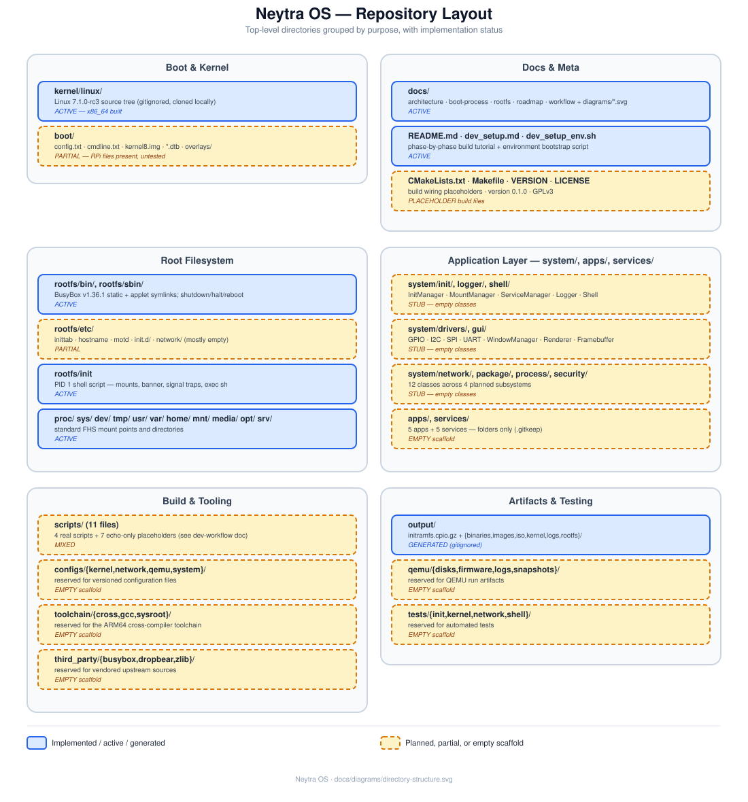

# Project Structure

A directory-by-directory reference for the whole repository. For the narrative version of how these pieces fit together, see [architecture.md](architecture.md); for the build/run commands, see [development-workflow.md](development-workflow.md).

## Root files

| Path | Purpose | Status |
|---|---|---|
| [`README.md`](../README.md) | Phase-by-phase build tutorial (the project's own learning journal / getting-started guide) | ACTIVE |
| [`dev_setup.md`](../dev_setup.md) | Rationale for every package the dev environment needs | ACTIVE |
| [`dev_setup_env.sh`](../dev_setup_env.sh) | Executable environment bootstrap (installs packages, sets up KVM group membership) | ACTIVE |
| [`docs/`](.) | This documentation | ACTIVE |
| [`CMakeLists.txt`](../CMakeLists.txt) | Builds the `neytra_logger` static library + `logger_test`; nothing else wired up yet | PARTIAL |
| [`Makefile`](../Makefile) | `@echo "Makefile placeholder"` only | PLACEHOLDER |
| [`VERSION`](../VERSION) | Currently `0.1.0` | ACTIVE |
| [`LICENSE`](../LICENSE) | GPLv3 | ACTIVE |

## `boot/`

Raspberry Pi boot-partition files: `config.txt`, `cmdline.txt`, `kernel8.img`, `bcm2711-rpi-4-b.dtb`, `initramfs.cpio.gz`, `overlays/` (empty). See [raspberrypi.md](raspberrypi.md) — files are present but the build path that would produce `kernel8.img` from this repo's `kernel/linux` doesn't exist yet.

## `kernel/`

`kernel/linux/` is a full upstream Linux kernel clone (Linux 7.1.0-rc3, ~9GB once built), configured and built for x86_64. **Gitignored** — not committed, cloned fresh by each developer. See [kernel-build.md](kernel-build.md).

## `rootfs/`

The tree packaged into the initramfs: `bin/` (BusyBox + symlinks), `sbin/` (shutdown + symlinks), `etc/` (inittab, hostname, motd, init.d/, network/), `init` (PID 1 script), plus standard empty FHS directories (`proc/`, `sys/`, `dev/`, `tmp/`, `usr/`, `var/`, `home/`, `mnt/`, `media/`, `opt/`, `srv/`, `lib/`). Fully documented in [rootfs.md](rootfs.md).

## `system/` — the planned C++ layer

All currently empty class stubs (see [architecture.md](architecture.md) for the full map):

Every folder below also has its own `README.md` (role, detailed SVG workflow diagram in
`design/`, file responsibilities, status) — see
[development-workflow.md](development-workflow.md#8-coding-conventions-observed-in-system)
for the convention.

| Folder | Files |
|---|---|
| `system/init/` | `IInitManager.hpp`, `InitManager.*`, `IMountManager.hpp`, `MountManager.*`, `IServiceManager.hpp`, `ServiceManager.*`, `main.cpp`, `README.md`, `design/init-workflow.svg` — 🚧 interface + DI skeleton implemented (built as `neytra_init`) |
| `system/logger/` | `ILogger.hpp`, `Logger.hpp`, `Logger.cpp`, `README.md`, `design/logger-workflow.svg` — ✅ implemented (built as `neytra_logger`) |
| `system/shell/` | `Shell.*`, `CommandParser.*`, `BuiltinCommands.*`, `main.cpp`, `README.md`, `design/shell-workflow.svg` |
| `system/process/` | `ProcessManager.cpp`, `Scheduler.cpp`, `IPC.cpp`, `README.md`, `design/process-workflow.svg` |
| `system/network/` | `NetworkManager.cpp`, `DHCPClient.cpp`, `WifiManager.cpp`, `SocketManager.cpp`, `README.md`, `design/network-workflow.svg` |
| `system/package/` | `PackageManager.cpp`, `Downloader.cpp`, `Installer.cpp`, `Repository.cpp`, `README.md`, `design/package-workflow.svg` |
| `system/security/` | `UserManager.cpp`, `PermissionManager.cpp`, `Sandbox.cpp`, `README.md`, `design/security-workflow.svg` |
| `system/drivers/` | `GPIO.cpp`, `I2C.cpp`, `SPI.cpp`, `UART.cpp`, `README.md`, `design/drivers-workflow.svg` |
| `system/gui/` | `WindowManager.cpp`, `Desktop.cpp`, `Renderer.cpp`, `Framebuffer.cpp`, `README.md`, `design/gui-workflow.svg` |
| `system/include/{common,config,utils}/` | Empty — reserved for shared headers |

## `apps/`

`calculator/`, `editor/`, `monitor/`, `settings/`, `terminal/` — each contains only `.gitkeep`. Reserved for GUI-era applications (Phase 10 in [roadmap.md](roadmap.md)).

## `services/`

`logging/`, `networking/`, `ssh/`, `updater/`, `watchdog/` — each contains only `.gitkeep`. Reserved for background system services, likely daemons managed by `system/init/ServiceManager` once it exists.

## `scripts/`

11 shell scripts; 4 are real and working, 7 are placeholders. Full table in [development-workflow.md](development-workflow.md#4-script-reference).

## `configs/`

`kernel/`, `network/`, `qemu/`, `system/` — each contains only `.gitkeep`. Reserved for versioned configuration files (e.g. a committed kernel `.config`, network interface templates, QEMU machine profiles) as an alternative to hand-editing files in place.

## `toolchain/`

`cross/`, `gcc/`, `sysroot/` — each contains only `.gitkeep`. Reserved for a vendored/pinned ARM64 cross-compilation toolchain, as an alternative to relying on the host's `gcc-aarch64-linux-gnu` package. See [kernel-build.md](kernel-build.md#cross-compiling-for-arm64-raspberry-pi).

## `third_party/`

`busybox/`, `dropbear/`, `zlib/` — each contains only `.gitkeep`. Reserved for vendoring these dependencies' source directly rather than relying on host packages (`dropbear` in particular would provide SSH — see `services/ssh/`).

## `tests/`

`init/`, `kernel/`, `network/`, `shell/` — each contains only `.gitkeep`. Reserved for automated tests, mirroring the `system/` subsystem names.

## `qemu/`

`disks/`, `firmware/`, `logs/`, `snapshots/` — each contains only `.gitkeep`. Reserved for QEMU run-time artifacts (persistent disk images, OVMF firmware copies, run logs, VM snapshots) as the project grows beyond the current stateless `-kernel`/`-initrd` boot.

## `output/`

Build output, **gitignored**: `initramfs.cpio.gz` (the only artifact currently generated) plus empty reserved subfolders `binaries/`, `images/`, `iso/`, `kernel/`, `logs/`, `rootfs/`.

## See also

- [architecture.md](architecture.md) — how these pieces relate at runtime.
- [development-workflow.md](development-workflow.md) — how to build/run/iterate on them.
- [roadmap.md](roadmap.md) — which of the "reserved/empty" folders get filled in which phase.
