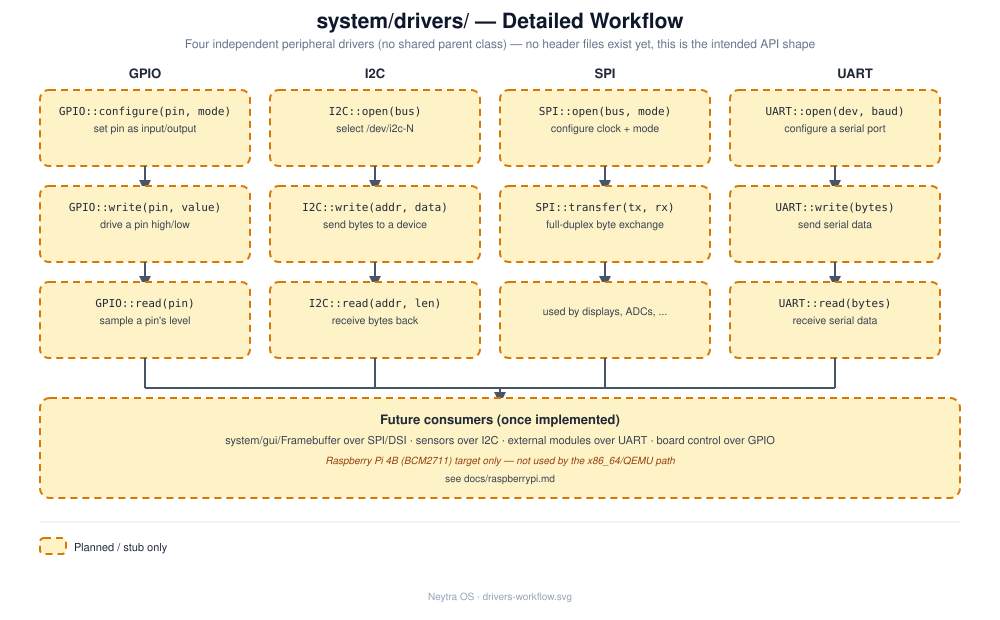

# `system/drivers/` — Drivers

## Role

Low-level peripheral drivers for the Raspberry Pi 4B target (Broadcom BCM2711). These
are only relevant to the [Raspberry Pi path](../../docs/raspberrypi.md) — the x86_64/QEMU
target this project boots today has no use for them.

## Status

**Stub — earliest stage.** Bare `.cpp` files with only a placeholder comment each and
**no header files yet**.

## Architecture

Four independent peripheral drivers, each with its own open/configure -> transfer ->
consumer flow (no shared parent class). See
[design/drivers-workflow.svg](design/drivers-workflow.svg) for the full per-driver detail.

## Files

| File | Responsibility (intended) |
|---|---|
| `GPIO.cpp` | General-purpose I/O pin access |
| `I2C.cpp` | I2C bus access (sensors, peripherals) |
| `SPI.cpp` | SPI bus access (e.g. displays) |
| `UART.cpp` | Serial port access |

## Technical notes

- No headers exist yet — when implementing, follow the interface + constructor-injection
  pattern established in [`system/init/`](../init/README.md) (`I<ClassName>.hpp` per
  class, dependencies injected via the constructor, wired together only in a composition
  root) — see [docs/architecture.md](../../docs/architecture.md#design-principles). Note
  that four independent, unrelated drivers may not need to share one interface each — use
  judgement (see design principle #6).
- These map to memory-mapped BCM2711 peripheral registers, not applicable when running
  under QEMU x86_64 — see [docs/raspberrypi.md](../../docs/raspberrypi.md) for the
  current (partial) state of that target: boot files exist, but there's no arm64
  `.config`/cross-compile step wired up yet, so this module has no way to be tested on
  real hardware today either.
- Likely future consumer: [`system/gui/Framebuffer`](../gui/README.md), if the GUI ever
  needs direct display hardware access beyond the kernel's own framebuffer device.

## See also

- [docs/raspberrypi.md](../../docs/raspberrypi.md)
- [docs/roadmap.md](../../docs/roadmap.md)
