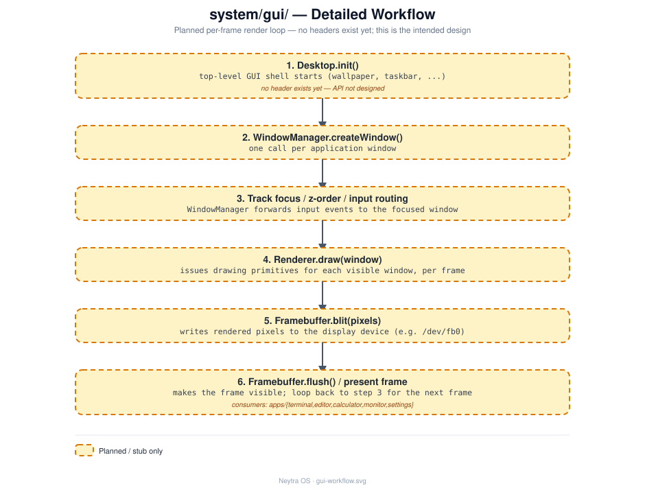

# `system/gui/` — GUI

## Role

Framebuffer-based graphical interface: windows, a desktop shell, and the rendering
underneath them.

## Status

**Stub — earliest stage.** Bare `.cpp` files with only a placeholder comment each and
**no header files yet**.

## Architecture

`Desktop` owns the `WindowManager`, which routes input and asks the `Renderer` to draw
each window, which in turn writes pixels through `Framebuffer`. See
[design/gui-workflow.svg](design/gui-workflow.svg) for the full per-frame detail.

## Files

| File | Responsibility (intended) |
|---|---|
| `Desktop.cpp` | Top-level GUI shell |
| `WindowManager.cpp` | Window placement, focus, stacking order |
| `Renderer.cpp` | Draws primitives/text/widgets |
| `Framebuffer.cpp` | Raw pixel access to the display device |

## Technical notes

- No headers exist yet — when implementing, follow the interface + constructor-injection
  pattern established in [`system/init/`](../init/README.md) (`I<ClassName>.hpp` per
  class, dependencies injected via the constructor, wired together only in a composition
  root) — see [docs/architecture.md](../../docs/architecture.md#design-principles).
- On the Raspberry Pi target, `Framebuffer` may eventually sit on top of
  [`system/drivers/`](../drivers/README.md) (e.g. SPI/DSI for a display) — that
  dependency doesn't exist yet either.
- `apps/{terminal,editor,calculator,monitor,settings}/` (currently just `.gitkeep`
  folders) are the eventual consumers of this module.
- Deferred deliberately: this is Phase 8 in [docs/roadmap.md](../../docs/roadmap.md),
  after `init`/`shell`/networking/package manager.

## See also

- [docs/architecture.md](../../docs/architecture.md)
- [docs/roadmap.md](../../docs/roadmap.md)
