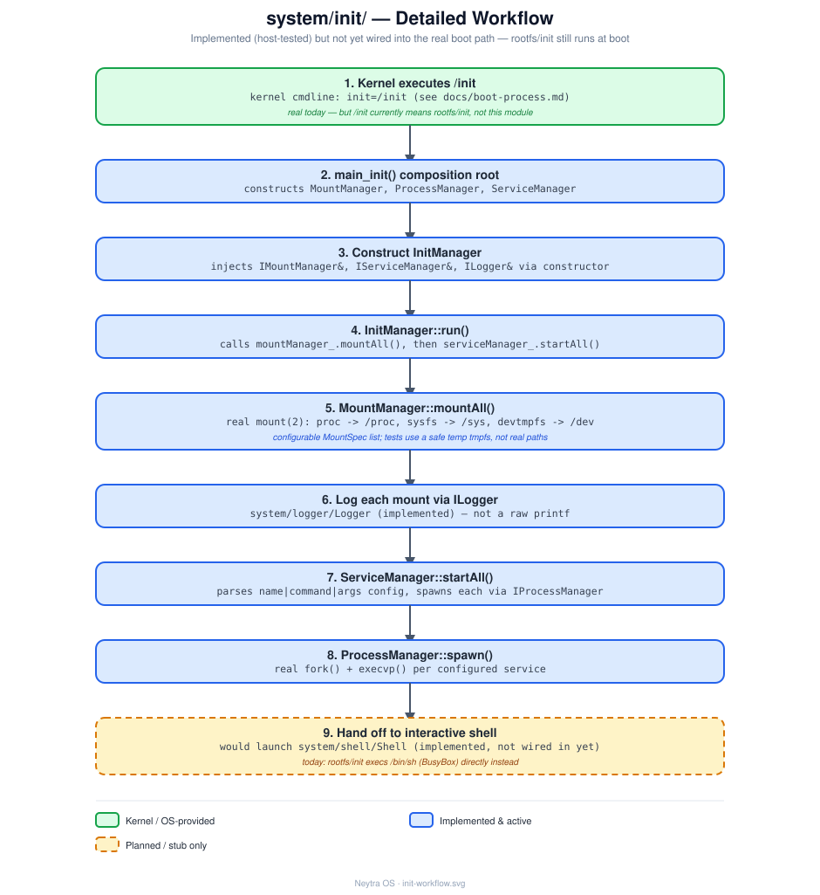

# `system/init/` — Init

## Role

Planned native replacement for [`rootfs/init`](../../rootfs/init) as PID 1: mount
filesystems, then start and supervise services. Today, `rootfs/init` (a POSIX shell
script) does this job for real; this module is where that logic moves once implemented.

## Status

**Implemented**, not wired into the real boot path yet. `IInitManager`/`IMountManager`/
`IServiceManager` are real interfaces; `InitManager` takes its two collaborators and an
`ILogger` via constructor injection; `MountManager::mountAll()` issues real `mount(2)`
syscalls (configurable mount list, defaulting to proc/sysfs/devtmpfs); `ServiceManager::startAll()`
parses a simple `name|command|args` config and spawns each entry through
[`system/process/IProcessManager`](../process/README.md). Everything compiles, links
(`neytra_init`), and is exercised by
[`tests/init/init_test.cpp`](../../tests/init/init_test.cpp) (mounting a harmless tmpfs
onto a temp dir, never the real `/proc`/`/sys`/`/dev`). `rootfs/init` (the shell script)
is still the real PID 1 today -- this module isn't invoked at boot yet.

## Architecture

`InitManager` is the top-level orchestrator: it delegates filesystem mounting to
`MountManager` and service startup/supervision to `ServiceManager`. See
[design/init-workflow.svg](design/init-workflow.svg) for the full planned call sequence,
step by step, compared against what `rootfs/init` actually does today.

## Files

| File | Responsibility |
|---|---|
| `main.cpp` | Composition root: constructs `MountManager`/`ProcessManager`/`ServiceManager`, injects them + `Logger::instance()` into `InitManager`, calls `run()` |
| `IInitManager.hpp` | Interface: `run()` |
| `InitManager.hpp` / `.cpp` | Top-level orchestrator; holds `IMountManager&`/`IServiceManager&`/`ILogger&` injected via its constructor (not owned/constructed internally) |
| `IMountManager.hpp` | Interface: `mountAll()`; also declares `MountSpec {source, target, filesystemType}` |
| `MountManager.hpp` / `.cpp` | Real `mount(2)` calls over a configurable `MountSpec` list (defaults to proc/sysfs/devtmpfs) |
| `IServiceManager.hpp` | Interface: `startAll()` |
| `ServiceManager.hpp` / `.cpp` | Parses a `name\|command\|arg1,arg2` config file and spawns each via the injected `IProcessManager&` |

## Technical notes

- **Dependency injection in practice**: `InitManager`'s constructor takes
  `IMountManager&`, `IServiceManager&`, and `ILogger&` — it never constructs its own
  collaborators. `system/init/main.cpp` (the composition root) is the only place that
  builds the concrete `MountManager`/`ServiceManager`/`Logger::instance()` and wires them
  together. See [docs/architecture.md](../../docs/architecture.md#design-principles) for
  why, and [tests/init/init_test.cpp](../../tests/init/init_test.cpp) for a second,
  independent composition (proving the wiring — not just `main.cpp` — actually works).
- **Today's real PID 1** is still [`rootfs/init`](../../rootfs/init) — see
  [docs/boot-process.md](../../docs/boot-process.md) for its exact behavior (mounts,
  banner, `trap "poweroff -f" SIGTERM SIGPWR`, then `/bin/sh`).
- Per [docs/roadmap.md](../../docs/roadmap.md), the next step is boot-testing this in
  QEMU **alongside** `rootfs/init` (e.g. via a debug shell command), and only removing
  the shell script's safety net once the C++ replacement is proven there too -- host-side
  tests alone (however real the syscalls they exercise) aren't the same as a real boot.
- `InitManager::run()` already logs through the injected `ILogger` rather than raw
  `printf` — that part of the pattern is real today, not just planned.

## See also

- [docs/architecture.md](../../docs/architecture.md)
- [docs/boot-process.md](../../docs/boot-process.md)
- [docs/roadmap.md](../../docs/roadmap.md)
