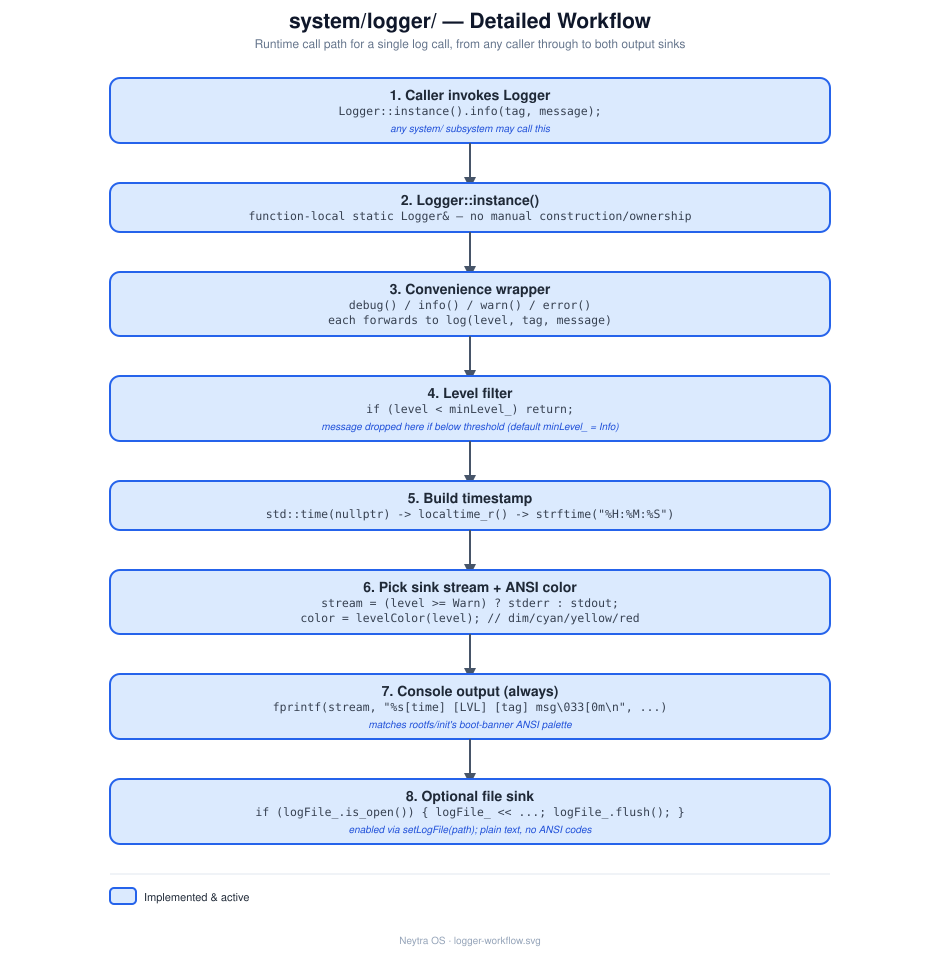

# `system/logger/` — Logger

## Role

Centralized, leveled logging for every other `system/` subsystem. It's the first real
module in the C++ layer — everything built after it (init, shell, services, ...) is
expected to log through it instead of calling `printf`/`std::cout` directly.

## Status

**Implemented.** Built as the static library `neytra_logger` (see root `CMakeLists.txt`),
covered by [`tests/logger/logger_test.cpp`](../../tests/logger/logger_test.cpp).

## Architecture

Every call goes through the single entry point `Logger::log()` (or its `debug`/`info`/
`warn`/`error` convenience wrappers), which fans out to up to two sinks: the console
(always) and a log file (only if `setLogFile()` was called first). Messages below the
configured minimum level are dropped before either sink is touched. See
[design/logger-workflow.svg](design/logger-workflow.svg) for the full call-by-call detail.

## Files

| File | Responsibility |
|---|---|
| `ILogger.hpp` | `enum class LogLevel`; the `ILogger` interface (`log`/`debug`/`info`/`warn`/`error`) — depend on this, not `Logger`, from other modules |
| `Logger.hpp` | `Logger : public ILogger`, the default implementation, plus config (`setMinLevel`, `setLogFile`) and the `instance()` singleton accessor |
| `Logger.cpp` | Level filtering, ANSI coloring, `HH:MM:SS` timestamping, dual-sink fan-out |

## Technical notes

- **Depend on `ILogger`, not `Logger`.** Every other module should take `ILogger&` as a
  constructor parameter (see [system/init/InitManager](../init/README.md) for the
  reference example) rather than calling `Logger::instance()` itself. Only composition
  roots (`main.cpp`, `tests/*/*_test.cpp`) are allowed to touch the concrete singleton —
  see [docs/architecture.md](../../docs/architecture.md#design-principles).
- **Singleton access**: `Logger::instance()` returns a function-local static — no manual
  construction, no ownership to manage. It exists purely as the one pragmatic default
  everything is wired to at composition roots.
- **Levels**: `LogLevel::{Debug, Info, Warn, Error}`, in that increasing order (scoped
  enums compare by underlying value). Default minimum level is `Info`.
- **Console coloring** matches the palette used by the [`rootfs/init`](../../rootfs/init)
  boot banner: dim for Debug, bold cyan for Info, bold yellow for Warn, bold red for Error.
  `Warn`/`Error` are written to `stderr`; `Debug`/`Info` to `stdout`.
- **File sink** is plain text (no ANSI) and opened in append mode via `std::ofstream`;
  disabled until `setLogFile(path)` succeeds.
- **Not thread-safe** — there are no threads anywhere in this project yet, so no locking
  was added (see the repo's "don't add what isn't needed yet" convention). Revisit if/when
  `system/process/` starts spawning real concurrent work.

## See also

- [docs/architecture.md](../../docs/architecture.md) — how this fits into the full stack, and the design-principles rules for depending on `ILogger`.
- [docs/roadmap.md](../../docs/roadmap.md) — Phase 6 status.
