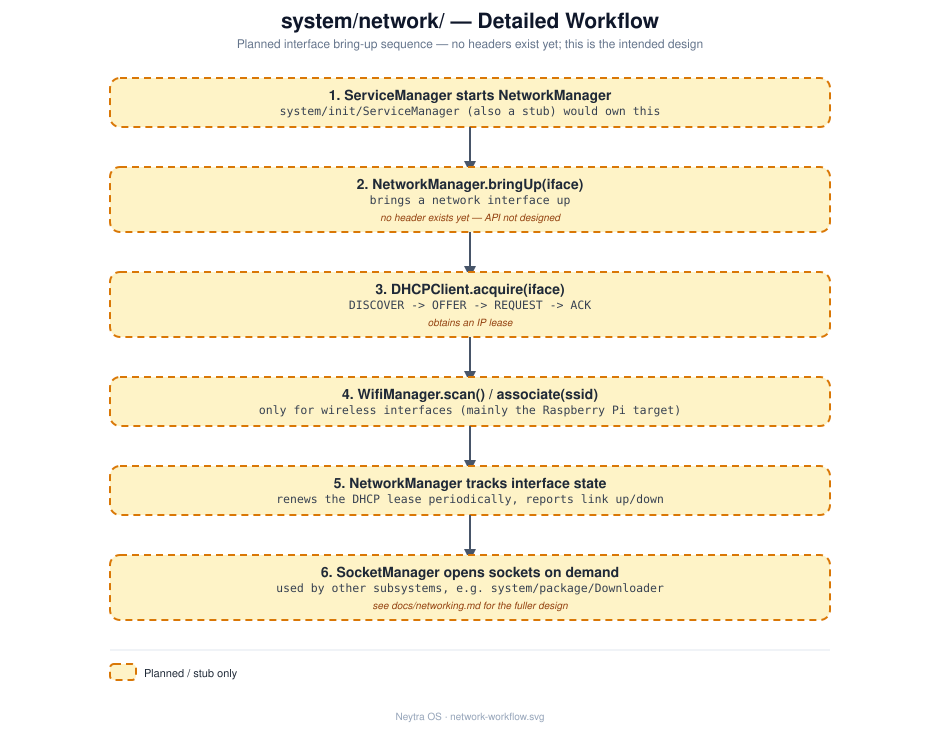

# `system/network/` — Network

## Role

Networking stack: interface bring-up, DHCP, Wi-Fi, and sockets. See
[docs/networking.md](../../docs/networking.md) for the fuller design discussion this
README summarizes.

## Status

**Stub — earliest stage.** Bare `.cpp` files with only a placeholder comment each and
**no header files yet**.

## Architecture

`NetworkManager` brings interfaces up and owns `DHCPClient`, `WifiManager`, and
`SocketManager`. See [design/network-workflow.svg](design/network-workflow.svg) for the
full step-by-step detail.

## Files

| File | Responsibility (intended) |
|---|---|
| `NetworkManager.cpp` | Top-level coordinator; brings interfaces up/down |
| `DHCPClient.cpp` | DHCP lease acquisition/renewal for an interface |
| `WifiManager.cpp` | Wi-Fi scanning/association (mainly for the Raspberry Pi target) |
| `SocketManager.cpp` | Socket lifecycle helper underpinning the above and `system/package/Downloader` |

## Technical notes

- No headers exist yet — when implementing, follow the interface + constructor-injection
  pattern established in [`system/init/`](../init/README.md) (`I<ClassName>.hpp` per
  class, dependencies injected via the constructor, wired together only in a composition
  root) — see [docs/architecture.md](../../docs/architecture.md#design-principles).
- BusyBox already provides basic networking applets (`ifconfig`, `route`, ...) as a
  stopgap before `NetworkManager` exists — check `rootfs/bin/busybox --list` for what's
  compiled in.
- Deferred deliberately: the project's own strategy (root
  [README.md](../../README.md)) says not to start with networking. This is Phase 7 in
  [docs/roadmap.md](../../docs/roadmap.md), after `init`/`shell` are working.
- `DHCPClient`/raw socket access will need privileged operations — expect this to
  eventually depend on [`system/security/`](../security/README.md) (`Sandbox` /
  `PermissionManager`) once that exists.

## See also

- [docs/networking.md](../../docs/networking.md) — full planned design
- [docs/roadmap.md](../../docs/roadmap.md)
