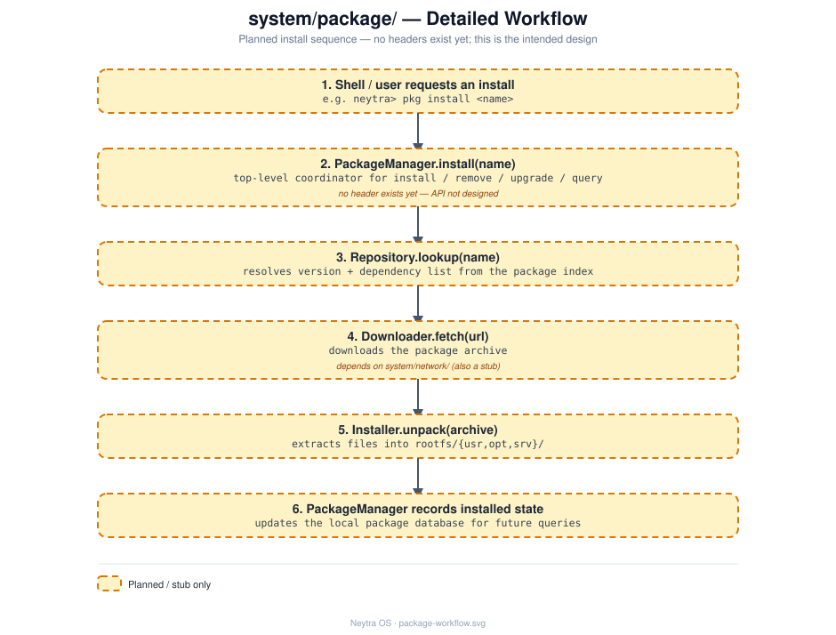

# `system/package/` — Package

## Role

Package management: install / remove / upgrade / query software. See
[docs/package-manager.md](../../docs/package-manager.md) for the fuller design
discussion this README summarizes.

## Status

**Implemented.** `Repository` (flat-file package index), `Downloader` (a real HTTP/1.1
GET client over a raw TCP socket -- no TLS), `Installer` (extracts archives by spawning
`tar` via [`system/process/ProcessManager`](../process/README.md)), and `PackageManager`
(orchestrates all three) are all real, built as `neytra_package`, covered by
[`tests/package/package_test.cpp`](../../tests/package/package_test.cpp) — which spins up
a throwaway local HTTP server to exercise the full install pipeline end to end.

## Architecture

`PackageManager` coordinates `Repository` (metadata), `Downloader` (fetch), and
`Installer` (unpack/place). See [design/package-workflow.svg](design/package-workflow.svg)
for the full step-by-step detail.

## Files

| File | Responsibility (intended) |
|---|---|
| `PackageManager.cpp` | Top-level coordinator: install/remove/upgrade/query |
| `Repository.cpp` | Package index/metadata — what's available, versions, dependencies |
| `Downloader.cpp` | Fetches package archives, presumably over `system/network/` |
| `Installer.cpp` | Unpacks and places files on disk, updates local package state |

## Technical notes

- Follows the interface + constructor-injection pattern from
  [`system/init/`](../init/README.md) (`IRepository`/`IDownloader`/`IInstaller`/
  `IPackageManager` + concrete classes) — see
  [docs/architecture.md](../../docs/architecture.md#design-principles).
- `Downloader` depends on [`system/network/ISocketManager`](../network/README.md)
  (constructor-injected) — plain HTTP/1.1 only, no TLS/HTTPS support.
- `Installer` shells out to the real `tar` binary via
  [`system/process/IProcessManager`](../process/README.md) rather than reimplementing
  archive parsing (see design principle #6: don't over-build what a standard tool already
  does well).
- Likely install targets are the already-existing empty directories `usr/`, `opt/`,
  `srv/` under [`rootfs/`](../../rootfs/); [`third_party/`](../../third_party/) hints at
  an intent to vendor some dependencies directly rather than only fetch at runtime.
- Deferred deliberately: this is Phase 7 in [docs/roadmap.md](../../docs/roadmap.md),
  after `init`/`shell` and networking are working.

## See also

- [docs/package-manager.md](../../docs/package-manager.md) — full planned design
- [docs/roadmap.md](../../docs/roadmap.md)
