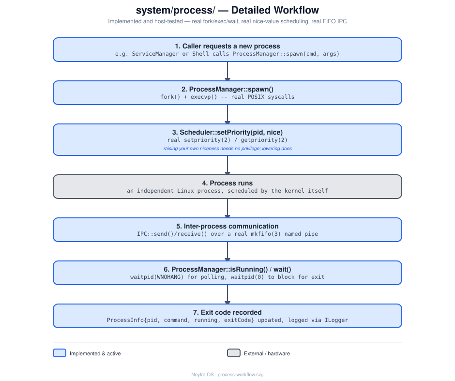

# `system/process/` — Process

## Role

Process lifecycle management (spawn / monitor / reap) and inter-process communication
primitives, for use by `system/init/ServiceManager` and any future subsystem that needs
to run or talk to other processes.

## Status

**Stub — earliest stage.** Unlike `init`/`shell`/`logger`, these are bare `.cpp` files
with only a placeholder comment (e.g. `// ProcessManager.cpp - placeholder`) and **no
header files yet** — there isn't even a class declared. Designing the `.hpp` API is the
first task here, before any implementation.

## Architecture

`ProcessManager` spawns and reaps processes, consults `Scheduler` for run order, and uses
`IPC` for message passing between them. See
[design/process-workflow.svg](design/process-workflow.svg) for the full step-by-step detail.

## Files

| File | Responsibility (intended) |
|---|---|
| `ProcessManager.cpp` | Spawn, monitor, and reap child processes |
| `Scheduler.cpp` | Decide run order / priority among managed processes |
| `IPC.cpp` | Message-passing primitives between processes |

## Technical notes

- No headers exist yet — when implementing, follow the interface + constructor-injection
  pattern established in [`system/init/`](../init/README.md) (`I<ClassName>.hpp` per
  class, dependencies injected via the constructor, wired together only in a composition
  root) — see [docs/architecture.md](../../docs/architecture.md#design-principles).
- Likely primary consumer: `system/init/ServiceManager` (../init/README.md), which needs
  to spawn and supervise services once it's implemented.
- Should log through [`system/logger/Logger`](../logger/README.md).
- Not on the critical path for the next roadmap milestone — see
  [docs/roadmap.md](../../docs/roadmap.md) (`init` and `shell` come first).

## See also

- [docs/architecture.md](../../docs/architecture.md)
- [docs/roadmap.md](../../docs/roadmap.md)
