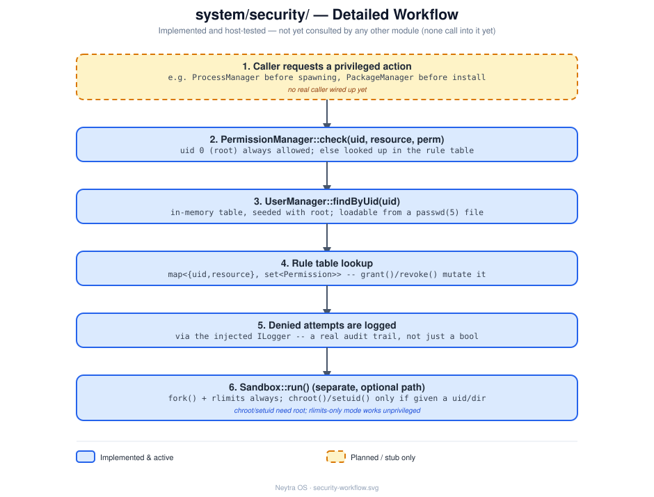

# `system/security/` — Security

## Role

Users, permissions, and process sandboxing — the gatekeeping layer any privileged
operation (mounting, networking, package installs) is expected to consult once
implemented.

## Status

**Stub — earliest stage.** Bare `.cpp` files with only a placeholder comment each and
**no header files yet**.

## Architecture

`PermissionManager` is the single gatekeeping entry point, consulting `UserManager` for
identity and `Sandbox` for isolation. See
[design/security-workflow.svg](design/security-workflow.svg) for the full step-by-step detail.

## Files

| File | Responsibility (intended) |
|---|---|
| `UserManager.cpp` | User accounts/identities |
| `PermissionManager.cpp` | Access checks against a policy (who may do what) |
| `Sandbox.cpp` | Process isolation/confinement |

## Technical notes

- No headers exist yet — when implementing, follow the interface + constructor-injection
  pattern established in [`system/init/`](../init/README.md) (`I<ClassName>.hpp` per
  class, dependencies injected via the constructor, wired together only in a composition
  root) — see [docs/architecture.md](../../docs/architecture.md#design-principles).
- Expected consumers once implemented: `system/process/ProcessManager` (before spawning
  anything privileged) and `system/network/`, `system/package/` (both currently stubs
  too, both need privileged operations).
- Deferred deliberately: this is Phase 9 in [docs/roadmap.md](../../docs/roadmap.md),
  well after `init`/`shell` are working.

## See also

- [docs/architecture.md](../../docs/architecture.md)
- [docs/roadmap.md](../../docs/roadmap.md)
