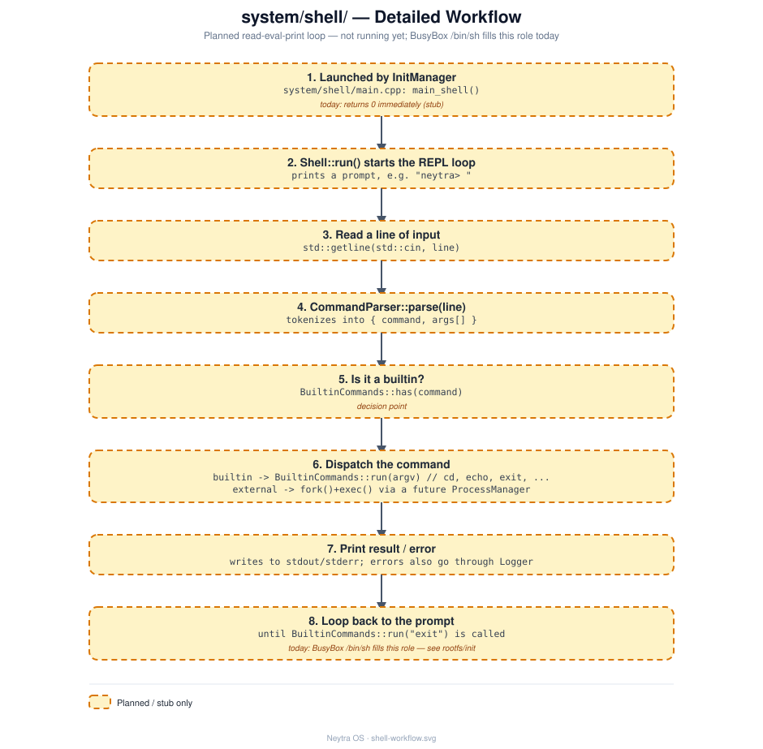

# `system/shell/` — Shell

## Role

Planned native replacement for BusyBox's `/bin/sh` as the top-level interactive
interface. Today, the boot flow ends with `rootfs/init` handing off to BusyBox's shell;
this module is where a Neytra-native shell would take over instead.

## Status

**Implemented, and reachable inside a booted VM.** `CommandParser` (quote-aware
tokenizer), `BuiltinCommands` (`cd`/`pwd`/`echo`/`export`/`unset`/`env`/`exit`/`help`),
and `Shell` (a real read-eval-print loop that spawns external commands via
[`system/process/ProcessManager`](../process/README.md)) are all real, built as
`neytra_shell`, covered by [`tests/shell/shell_test.cpp`](../../tests/shell/shell_test.cpp).
It's also built as a statically-linked executable, `neytra-shell` (see `main.cpp` /
root `CMakeLists.txt`), installed into `rootfs/usr/bin/` by `scripts/build_system.sh` --
run it manually from the BusyBox prompt after boot to try it for real (see
[system/README.md](../README.md) for the full step-by-step guide, with a real transcript).
It is **not** the automatic login shell yet, though -- BusyBox `/bin/sh` is still what
`rootfs/init` hands off to at boot (see [docs/roadmap.md](../../docs/roadmap.md)).

## Architecture

The planned flow is a classic read-eval-print loop: `Shell` reads a line, hands it to
`CommandParser` for tokenizing, then dispatches to either `BuiltinCommands` or an external
process. See [design/shell-workflow.svg](design/shell-workflow.svg) for the full step-by-step detail.

## Files

| File | Responsibility |
|---|---|
| `main.cpp` | Composition root; `main_shell()` builds the collaborators, `main()` makes it the real `neytra-shell` executable |
| `Shell.hpp` / `.cpp` | The read-eval-print loop; owns a `CommandParser` and `BuiltinCommands` |
| `CommandParser.hpp` / `.cpp` | Tokenizes a raw input line into a command + arguments |
| `BuiltinCommands.hpp` / `.cpp` | Implements builtins that can't be external processes (e.g. `cd`) |

## Technical notes

- **When implementing**, follow the interface + constructor-injection pattern
  established in [`system/init/`](../init/README.md) (an `I<ClassName>.hpp` interface
  per class — `IShell`, `ICommandParser`, ... — with dependencies like `ILogger`
  injected via the constructor, wired together only in `main.cpp`) — see
  [docs/architecture.md](../../docs/architecture.md#design-principles).
- **Today's real shell** is BusyBox's `/bin/sh`, reached via the last line of
  [`rootfs/init`](../../rootfs/init) — see
  [docs/boot-process.md](../../docs/boot-process.md).
- Per [docs/roadmap.md](../../docs/roadmap.md) step 3, the target for a first working
  version is small: enough builtins (`cd`, `echo`, `exit`) to replace the final
  `exec /bin/sh` call, not full shell-language parity (pipes, redirection, etc. can come
  later).
- Should log through [`system/logger/Logger`](../logger/README.md) for diagnostics
  rather than raw `printf`.
- Depends conceptually on `system/init/ServiceManager` (../init/README.md) to be the
  thing that eventually launches it, instead of `rootfs/init` doing so directly.

## See also

- [docs/architecture.md](../../docs/architecture.md)
- [docs/roadmap.md](../../docs/roadmap.md)
